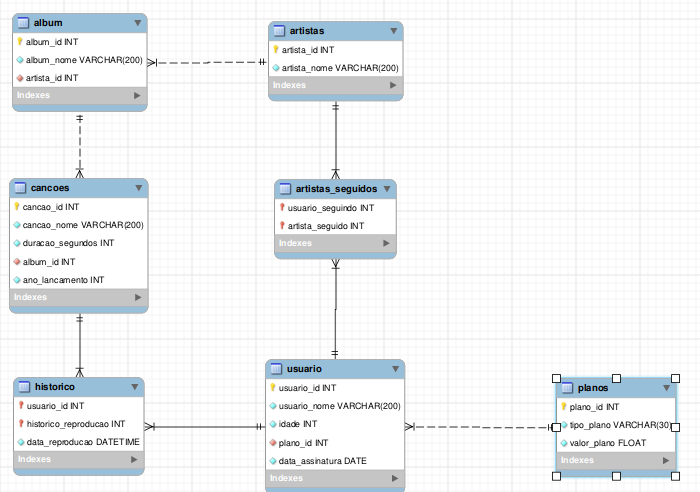

# SQL Challenges Project README

## Project Overview

This project focuses on normalizing a denormalized table and performing SQL queries to extract relevant information. The challenges involve addressing various aspects of SQL, from database design to complex queries.

## Development

### Technologies Used

- SQL

## Schema Normalization
Schema normalization is a process in relational database design that organizes columns and tables to minimize data redundancy and improve data integrity. It involves decomposing a table into less redundant (and smaller) tables but without losing information; defining foreign keys in the old table referencing the primary keys of the new ones. The objective is to isolate data so that additions, deletions, and modifications of a field can be made in just one table and then propagated through the rest of the database using the defined foreign keys.

The normalized tables for this project are shown below:

### Project Structure

The project's structure revolves around SQL files, each dedicated to solving a specific challenge:

- **desafioN.sql**: Contains the SQL code for the corresponding challenge, where N is the challenge number.

## Project Requirements

### Challenges

<details>
<summary>Challenge List</summary>

1. **Database Creation and Normalization:**
   - Create a database named SpotifyClone.
   - Provide the necessary queries to create normalized tables that meet the specified requirements.
   - Provide queries to populate the tables with the listed data.

2. **Query for Total Counts:**
   - Create a query displaying three columns:
     - Total quantity of songs (alias: "cancoes").
     - Total quantity of artists (alias: "artistas").
     - Quantity of albums (alias: "albuns").

3. **User Listening Statistics:**
   - Create a query with three columns:
     - User name (alias: "usuario").
     - Number of songs listened to by the user (alias: "qt_de_musicas_ouvidas").
     - Total minutes listened by the user (alias: "total_minutos").
   - Group results by user name, ordered alphabetically.

4. **Active Users as of 2021:**
   - Show users who were active from the year 2021 based on the most recent date in their listening history.
   - Display user name (alias: "usuario") and user status (alias: "status_usuario").
   - Order results alphabetically.

5. **Top 2 Most Played Songs:**
   - Display the names of the top 2 most played songs.
   - Columns: "cancao" (song name) and "reproducoes" (number of plays).
   - Order by play count descending, then by song name alphabetically in case of a tie.

6. **Billing Information:**
   - Query to display:
     - Minimum plan value ("faturamento_minimo").
     - Maximum plan value ("faturamento_maximo").
     - Average plan value ("faturamento_medio").
     - Total revenue from plans ("faturamento_total").
   - Round monetary values to two decimal places.

7. **Artist Albums and Followers:**
   - Show a list of albums produced by each artist, ordered by the number of followers they have.
   - Columns: "artista" (artist name), "album" (album name), "seguidores" (followers).
   - Order by followers count descending, then by artist name alphabetically, and album name alphabetically in case of a tie.

8. **Elis Regina's Albums:**
   - Display albums produced by the artist "Elis Regina."
   - Columns: "artista" (artist name), "album" (album name).
   - Order results by album name alphabetically.

9. **Barbara Liskov's Listening History:**
   - Show the number of songs currently in the listening history of the user "Barbara Liskov."
   - Column: "quantidade_musicas_no_historico."

10. **Song Plays for Free and Personal Plans:**
    - Display the name and play count of each song played by users with free or personal plans.
    - Columns: "nome" (song name), "reproducoes" (play count).
    - Group results by song name, ordered alphabetically.

11. **Bonus - Song Name Modifications:**
    - Alter the names of specific songs based on given criteria.
    - Display columns: "nome_musica" (original name), "novo_nome" (new name).
    - Select only the songs with modified names.
    - Criteria:
      - Replace "Bard" with "QA."
      - Replace "Amar" with "Code Review."
      - Replace "Pais" at the end with "Pull Requests."
      - Replace "SOUL" at the end with "CODE."
      - Replace "SUPERSTAR" at the end with "SUPERDEV."

</details>

### SQL Queries

Each SQL file corresponds to a specific challenge and contains a single SQL query solving that challenge. For instance, the file `desafio1.sql` might include a query like:

```sql
-- Challenge 1: Creating the SpotifyClone Database
CREATE DATABASE IF NOT EXISTS SpotifyClone;

-- Additional SQL queries for table creation and data population
-- ...
```

## Code Annotations

- Each SQL file is named according to the challenge number (e.g., `desafio1.sql`).
- Queries within the files follow the specified format and include the necessary semicolons.
- Code adheres to the defined conventions, such as avoiding the use of `USE SpotifyClone` in the SQL files.

## Feedback

Your feedback is crucial! Please provide insights and suggestions regarding the project. I am eager to incorporate any recommendations you may have.

## Portfolio

Explore more of my work in my [portfolio](my-folio-weld.vercel.app/)!

